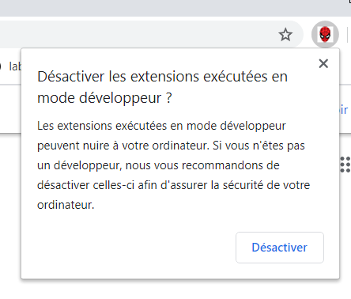
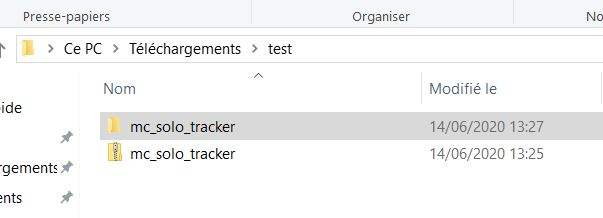
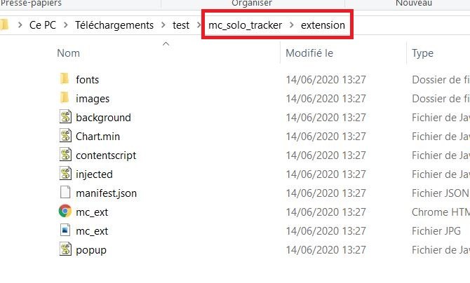
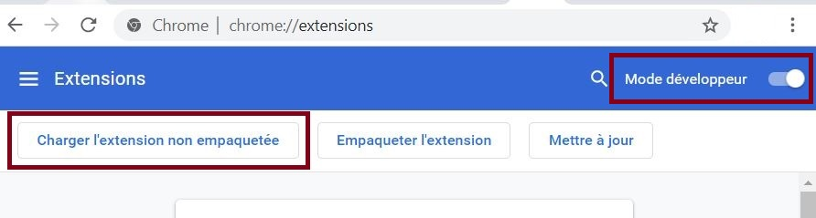
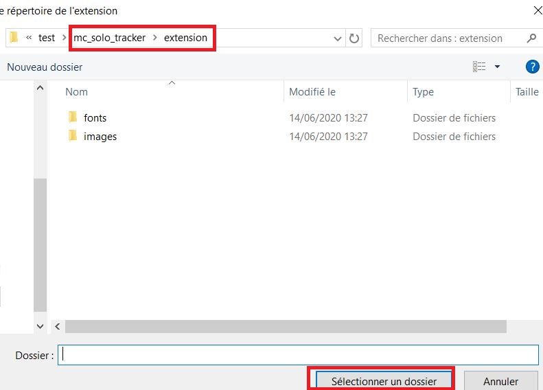
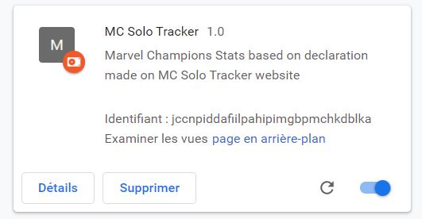
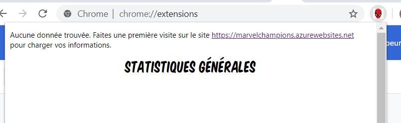
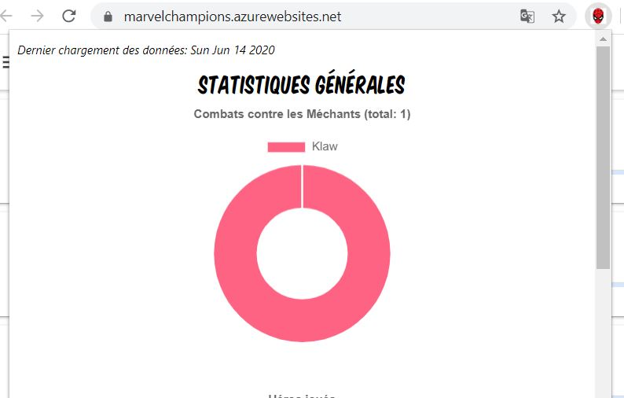
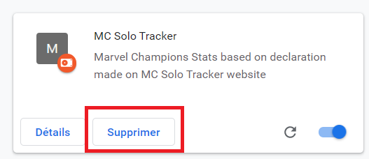

# MARVEL CHAMPIONS SOLO TRACKER STATS - CHROME EXTENSION - INSTALLATION GUIDE 
---
## LIRE ATTENTIVEMENT AVANT L'INSTALLATION
Quelques précautions/rappels avant de procéder à l'installation de l'extension:
* cette extension n'a été développée et testée que sous Windows 10 et Chrome 83. Elle ne fonctionne pas pour Firefox. Je ne sais pas si elle fonctionne sous Chrome Mac.
* l'auteur du site de tracking [MC Solo Tracker](https://marvelchampions.azurewebsites.net/) préconise une utilisation sur mobile. Or cette extension est plutôt vouée à être utilisée sur un ordinateur. Si vous avez utilisé l'outil pour logger vos parties depuis votre mobile alors il vous faudra vous authentifier via Facebook Connect pour une synchronisation de la progression entre vos différents appareils.
* l'extension doit être utilisée sur le même ordinateur + navigateur que celui qui vous sert à saisir le résultat de vos parties solo
* cette extension ne peut pas fonctionner en navigation privée
* cette extension peut cesser de fonctionner du jour au lendemain en cas de mise à jour impactante dans la structure de données du site [MC Solo Tracker](https://marvelchampions.azurewebsites.net/)
* les noms des méchants et scénarios sont en anglais, c'est ainsi qu'ils sont récupérés depuis le site de tracking

**Note:** cette extension n'étant pas publiée sur le Chrome Web Store, il vous faut utiliser Chrome en mode développeur. Rien de bien grave, c'est très facile (cf. détails dans la procédure ci-dessous).
Il y a toutefois un inconvénient un peu gênant: lors du lancement de Chrome, une popup peut apparaître pour vous suggérer de désactiver ce mode développeur. Il suffit alors de la fermer en cliquant sur la croix (**attention** de ne pas cliquer sur le bouton "Désactiver" !).

## COMMENT INSTALLER L'EXTENSION ?
1. Téléchargez le zip de la dernière version de l'extension disponible [ici](https://github.com/nidragedd/mc_solo_tracker_extension/blob/master/mc_solo_tracker_v0.4.zip). (Autre option pour développeurs ou si vous voulez être certains du code qui est exécuté: vous pouvez cloner ce repository de code et aller directement à l'étape 3).
2. Dézippez quelque part sur votre ordinateur:

3. Ouvrez un nouvel onglet dans chrome et saisissez dans la barre d'adresse: chrome://extensions. Puis faites basculer le "mode développeur" afin de pouvoir visualiser le bouton "Charger l'extension non empaquetée".

4. Naviguez jusqu'au dossier racine de l'extension. Puis cliquez sur "Sélectionner un dossier".

5. Si tout s'est bien passé, il devrait y avoir la petite icône Spiderman en haut et cette extension affichée:

6. Cliquez sur l'icône Spiderman, cela devrait afficher un message indiquant que les données ne sont pas disponibles. En effet, celles-ci ne sont synchronisées que lorsque le site [MC Solo Tracker](https://marvelchampions.azurewebsites.net/) est visité avec cette extension installée.

7. Visitez le site de tracking [MC Solo Tracker](https://marvelchampions.azurewebsites.net/) puis recliquez sur l'icône Spiderman. Cette fois-ci, les données devraient avoir été chargées correctement et la popup devrait afficher des statistiques.

## INSTALLER UNE NOUVELLE VERSION DE L'EXTENSION
| Version | Lien | Description                                                                                                                                                                                      |
|---------|------|--------------------------------------------------------------------------------------------------------------------------------------------------------------------------------------------------|
| 0.5     | [Download](https://github.com/nidragedd/mc_solo_tracker_extension/blob/master/mc_solo_tracker_v0.5.zip) | Ajout des personnages de la campagne Crâne Rouge et gestion du cas particulier SpiderWoman - Correction du bug d'affichage sur Winrate si pas de partie jouée |
| 0.4     | [Download](https://github.com/nidragedd/mc_solo_tracker_extension/blob/master/mc_solo_tracker_v0.4.zip) | Ajout stats globales des taux de victoire par aspect/affinité et pour chaque méchant |
| 0.3     | [Download](https://github.com/nidragedd/mc_solo_tracker_extension/blob/master/mc_solo_tracker_v0.3.zip) | Ajout du taux de victoire par héros et du nombre de combats par aspect/affinité |
| 0.2     | [Download](https://github.com/nidragedd/mc_solo_tracker_extension/blob/master/mc_solo_tracker_v0.2.zip) | Ajout des statistiques similaires pour chaque méchant (sans devoir filtrer sur un scénario) Correction de l'effet désagréable sur la sélection de méchant ou scénario (remontée en haut de page) |
| 0.1     | [Download](https://github.com/nidragedd/mc_solo_tracker_extension/blob/master/mc_solo_tracker.zip)      | Version initiale, contient les statistiques pour chaque couple méchant+scénario                                                                                                                  |

Procédé:
1. Téléchargez le zip correspondant à la version souhaitée et dézippez le quelque part sur votre ordinateur, tout comme pour l'installation de base.

2. Ouvrez un nouvel onglet dans chrome et saisissez dans la barre d'adresse: chrome://extensions. Vous pouvez alors supprimer  de Chrome l'ancienne extension déjà installée:  

3. Suivez la procédure classique d'installation, cette fois-ci en choissisant le dossier contenant la nouvelle version de l'extension.

**Pas de panique !**: si jamais cette manipulation échoue, supprimez l'extension de Chrome ainsi que tous les dossiers contenant les différentes versions de l'extension puis recommencez la procédure de base.  
**Aucune donnée n'étant sauvegardée** directement dans l'extension, vous ne pouvez pas perdre votre progression qui reste, quant à elle, stockée sur le site de tracking [MC Solo Tracker](https://marvelchampions.azurewebsites.net/).  
Cette procédure est sans risque. Si toutefois vous constatiez un dysfonctionnement quelconque trop impactant, vous pouvez toujours réinstaller la version précédemment installée en choisissant l'ancien répertoire sur votre ordinateur.

4. Si tout fonctionne comme souhaité, vous pouvez supprimer de votre ordinateur le répertoire correspondant à l'ancienne version de l'extension.
