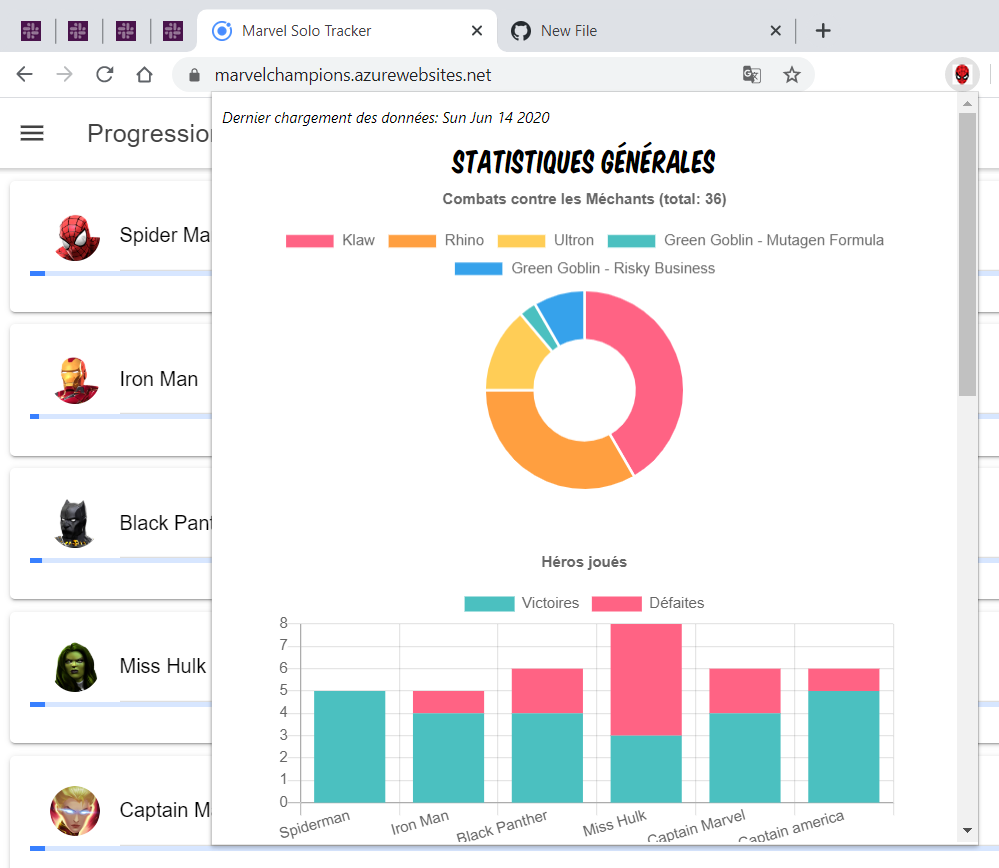

# MARVEL CHAMPIONS SOLO TRACKER STATS - CHROME EXTENSION
A french guy made a cool logging website in order to save the results of our differents solo games while playing Marvel Champions Living Card Game.  
This website is able to display some statistics about the heroes that have been played and so on.  
Fact is: when I choose a hero, I like to try it on different villains so I wanted to have a view showing me, for each villain/scenario:
* with which hero did I win ?
* with which hero did I lose ?
* most played aspect ?
* and a checklist of hero/aspect games

## SCREENSHOTS
Here are some examples of what you can see by using this extension:

## WARNING
The [MC Solo Tracker](https://marvelchampions.azurewebsites.net/) website stores its data in browser local storage so this extension only works if:
* you install it on the same device as the one you used to log your games
* you do not use the private browsing functionnality

## DEVICE COMPATIBILITY
Tested only on Windows 10 and Chrome 83. As we say in IT: "it works on my machine !".
This extension does not work on Firefox.

## CREDITS
* I would like to thanks the owner of [MC Solo Tracker](https://marvelchampions.azurewebsites.net/) who is nicely giving us access to a wonderful logging solution.
* I have been inspired by [SuperHuman Registration Act](https://superhumanregistrationact.com/) website for few parts of the design (the komica font for instance).

## RESOURCES
It was the first time I built a Chrome extension. Those resources were very helpful:
* [Official documentation for Chrome extensions](https://developer.chrome.com/extensions)
* [Developer documentation for Chrome](https://developer.chrome.com/apps/runtime)
* [Sending message from injected content script to the background page](https://stackoverflow.com/questions/9106519/port-error-could-not-establish-connection-receiving-end-does-not-exist-in-chr)
* [Kind of tutorial "How to start?"](https://thoughtbot.com/blog/how-to-make-a-chrome-extension)
